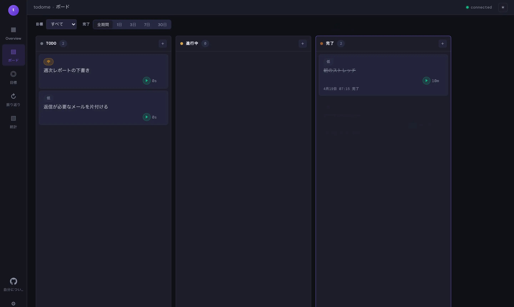
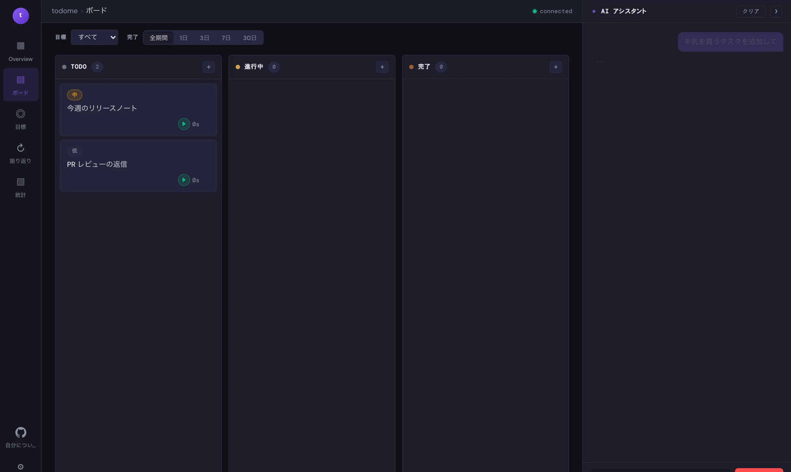
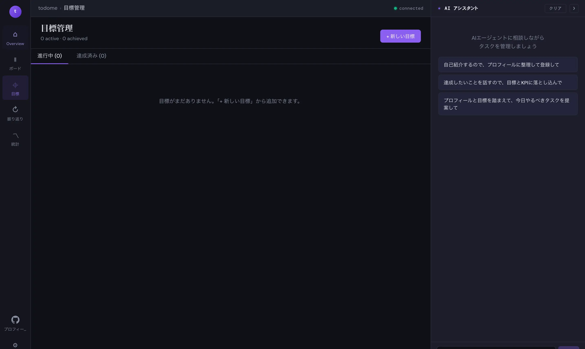
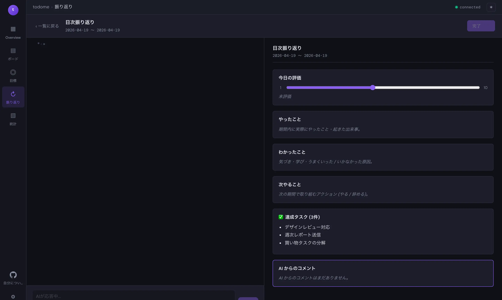
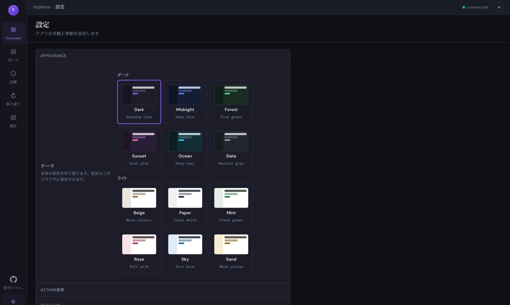

# todome

[日本語](README.md) | English

- **Kanban board** — Three columns (TODO / In Progress / Done) with drag & drop
- **AI assistant** — Claude advises and manipulates tasks while aware of your board and goals
- **Goal management** — Set goal name, notes, multiple KPIs, deadline, and link tasks to goals
- **Time tracking** — Per-task play/pause, estimate comparison, completion time recording
- **Stats dashboard** — Pie chart of work time per goal, bar charts for daily/monthly/yearly trends
- **Profile definition** — Reflects your current state, balance wheel, principles, and wishes into the AI context
- **GitHub sync** — Share data across devices & link repositories to goals to feed the AI context ([Terms of Service notes](docs/github-sync-compliance.md))

| Task management with Kanban | Leave task management to AI | Plan goals and tasks with AI |
|:---:|:---:|:---:|
|  |  |  |
| **Retrospective with AI** | **Switch themes to change mood** | **Git-backed history** |
|  |  |  |

## Concept

todome is a finished app, but it is also designed as **an app that users fork and grow into their own personal management environment**.
Feel free to tweak it to your taste in your own environment.

- Add original features with your own AI agents
- Freely rewrite the UI and behavior to match your workflow

### Why we don't distribute it as a finished app

In an era when AI can quickly build simple apps, **"building it yourself" is often faster than "searching the store for an app"**.
That's how hard it is to find an app that matches 100% of your requirements.

As AI-built apps flood the stores, users will find it even harder to discover apps, and individually developed apps may gradually stop being chosen.

So we thought: **users may be happier building the apps they want than endlessly searching the store for them.**
Selling fish to users while keeping a cheat fishing rod to ourselves feels unfair.
We'd rather hand users that cheat fishing rod too, and have them say "this app is still higher quality than what I'd build, so I'll use it."

todome is designed as an app each user can grow into their ideal shape in their local environment.
By releasing the app as a development platform, the concept is to let users experience **the joy of building their own app.**

## User Manual

The user manual is located in `docs/manual/`.

- Public URL: https://tanitaka-tech.github.io/todome/manual/
- How to update: see [docs/manual/README.md](docs/manual/README.md)
- Local view: `cd docs && python3 -m http.server 8765` → `http://127.0.0.1:8765/manual/`

## Setup

### Prerequisites

- **Node.js** 18+
- **[Bun](https://bun.sh/)** 1.3+ (server runtime)
- A contracted ClaudeCode with an **Anthropic API Key**, or an environment already logged in via `claude login`
- **[gh CLI](https://cli.github.com/)** (optional — required only for GitHub sync)

### 1. Clone the repository

```bash
git clone https://github.com/<your-org>/todome.git
cd todome
```

### 2. Configure environment variables (skip if already logged in via `claude login`)

If you're already logged in with `claude login`, you don't need to set an Anthropic API Key. Skip this step and move on.

If you want to use an API Key instead, or if you want to change the data directory or port, create `.env` in the project root. A sample is included as `.env.example`, so copying that is the quickest path:

```bash
cp .env.example .env
# Uncomment and edit only the values you need
```

### 3. Install dependencies

```bash
# Server (Bun)
bun install

# Frontend
cd client
npm install
cd ..
```

## How to run

### One-command start (recommended)

```bash
./start.sh          # Dev mode (runs Vite + bun --watch in parallel)
./start.sh prod     # Prod mode (builds client, then runs Bun only)
```

- Dev mode serves at **http://localhost:5173**, prod mode at **http://localhost:3002**.
- Ctrl+C stops both processes.
- If `client/node_modules` or `node_modules` is missing, `npm install` or `bun install` runs automatically on first launch.

### Manual startup

<details>
<summary>Dev mode (two terminals)</summary>

```bash
# Terminal 1: frontend (HMR)
cd client && npm run dev
```

```bash
# Terminal 2: backend (hot reload)
bun --watch server/index.ts
```
</details>

<details>
<summary>Prod mode (single server)</summary>

```bash
cd client && npm run build && cd ..
bun server/index.ts
```
</details>

## Tech stack

| Layer | Tech |
|---|---|
| Frontend | React 19 + Vite + TypeScript |
| Backend | Bun + Hono + WebSocket (TypeScript) |
| AI | Claude Agent SDK (Sonnet) |
| Transport | Real-time bi-directional WebSocket |

## File layout

```
todome/
├── server/                  # Bun + Hono + WebSocket backend
│   ├── index.ts             # Entry point (Bun.serve)
│   ├── config.ts / db.ts / state.ts
│   ├── storage/             # SQLite I/O (kanban / goals / profile / retro / github)
│   ├── ai/                  # Claude Agent SDK wrappers
│   ├── github/              # gh CLI / git integration (sync / diff / autosync)
│   └── ws/                  # WebSocket endpoint and handler dispatch
├── package.json             # Server dependencies (Bun)
├── .gitignore
├── README.md
├── data/                    # SQLite DB & GitHub sync state (gitignored)
└── client/
    ├── package.json         # Frontend dependencies
    ├── index.html           # HTML entry point
    ├── vite.config.ts       # Vite config
    ├── tsconfig*.json       # TypeScript config
    ├── public/
    │   └── favicon.svg
    └── src/
        ├── main.tsx         # React mount point
        ├── types.ts         # Type definitions
        ├── style.css        # Styling
        ├── hooks/
        │   └── useWebSocket.ts
        └── components/
            ├── App.tsx             # Root component (state & timers)
            ├── KanbanBoard.tsx     # Kanban board (D&D, timers)
            ├── ChatPanel.tsx       # AI chat panel
            ├── AskUserCard.tsx     # AI question card
            ├── TaskDetailModal.tsx  # Task detail modal
            ├── GoalPanel.tsx       # Goal management panel
            ├── StatsPanel.tsx      # Stats dashboard
            └── ProfilePanel.tsx    # Profile editor
```

## Architecture

```
Browser (React)                         Server (Bun + Hono)
┌──────────────────┐                   ┌──────────────────┐
│  KanbanBoard     │──kanban_*────→    │                  │
│  GoalPanel       │──goal_*──────→    │  State manager    │
│  ProfilePanel    │──profile_*───→    │  (tasks/goals/    │
│                  │←─*_sync──────     │   profile)        │
├──────────────────┤                   │                  │
│  ChatPanel       │──message─────→    │  Claude Agent SDK │
│                  │──ask_response─→   │  - TodoWrite     │
│                  │←─stream_delta─    │  - AskUser       │
│                  │←─assistant────    │  - GOAL_ADD/UPDATE│
│                  │←─kanban_sync──    │                  │
│                  │←─goal_sync────    │                  │
└──────────────────┘                   └──────────────────┘
```

## Special Thanks

See [docs/special-thanks.md](docs/special-thanks.md) for references that helped shape todome.

## License

MIT
